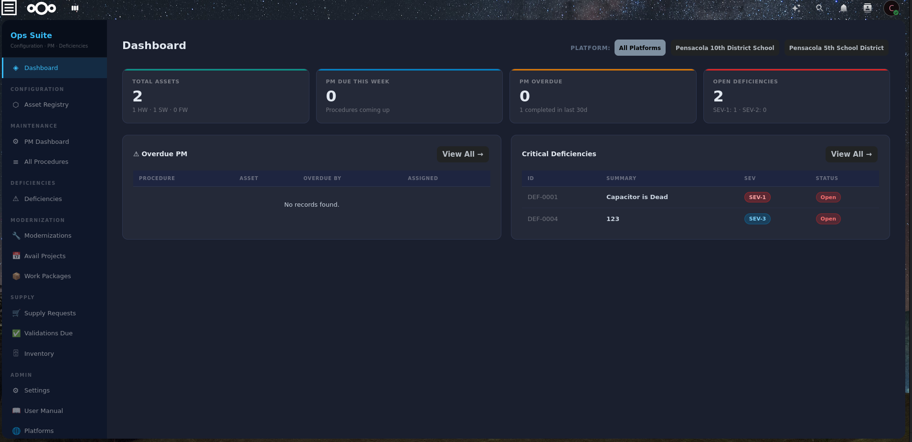
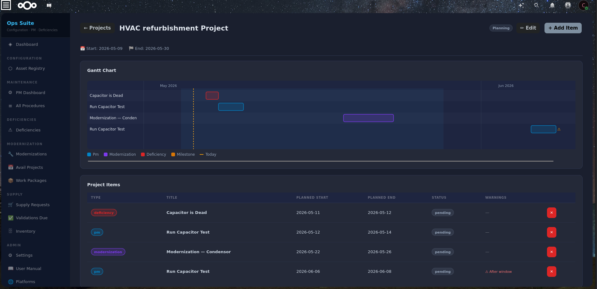
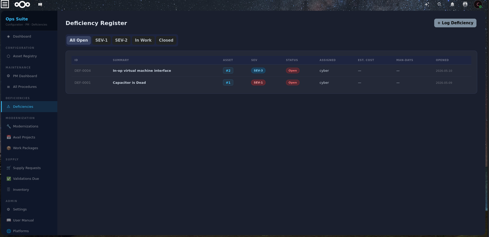
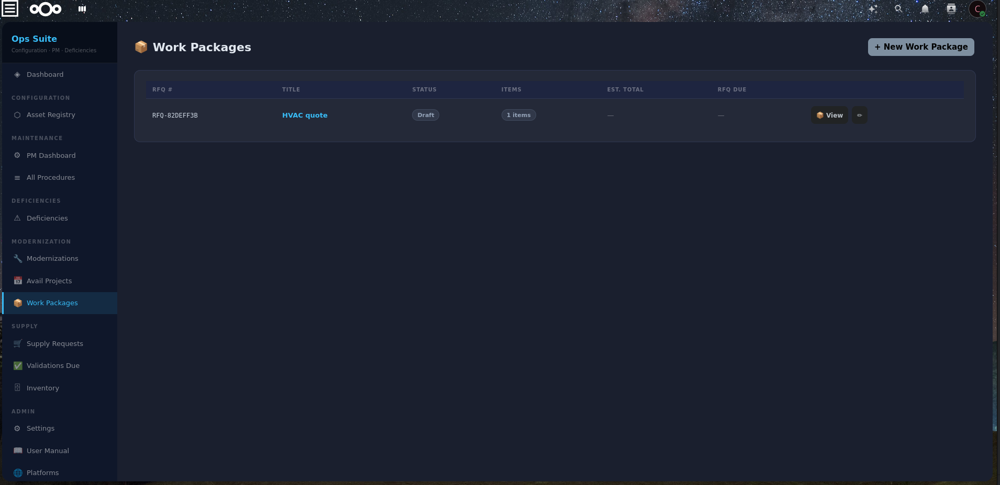

# Maintain Ops Suite

**Integrated Operations Management for Nextcloud**  
*Developed by [Alto Technologies LLC](https://altotechnologiesllc.com)*

[](https://www.gnu.org/licenses/agpl-3.0)
[](https://nextcloud.com)
[](https://github.com/Cyberseal89/maintain-ops-suite-nextcloud/releases)

---

## Overview

Maintain Ops Suite is a comprehensive operations management platform built as a Nextcloud app. Designed for field operations teams, maintenance departments, facilities managers, and organizations that need to track equipment, manage preventive maintenance, resolve deficiencies, and control modernization projects — all within their existing Nextcloud infrastructure.

The platform pairs with the **Maintain Ops Suite Android mobile app** (pending Google Play release) for field technician access from anywhere.

---

## Modules

### 🏷 Configuration Registry (Assets)
- Track hardware, software, and firmware as a unified digital twin
- Full cross-linking between related assets
- ISO/IEC 15459 Unique Item Identifier (UII) support with auto-generation
- DoD IUID compliance flag and CAGE code tracking
- 18-month verification cycle with automatic tracking
- Warranty expiry alerts
- Multi-platform assignment

### 🔧 Preventive Maintenance
- Schedule PM procedures linked to configuration assets
- Periodicities: As Required, Weekly, Monthly, Quarterly, Semi-Annual, Annual
- Auto-calculates next due dates on completion
- Tracks actual hours, parts cost, labor cost, and completion notes
- Overdue alerts on dashboard
- SOP document linking via Nextcloud Files

### ⚠ Deficiency Tracking
- SEV-1 through SEV-5 severity classification
- Discovery methods: Walkdown, PM, Automated Alert, User Report, CVE Scan, Incident Response
- Full troubleshooting history timeline
- Cost tracking: estimated and actual (parts, labor, contractor)
- Man-days and outage hours tracking
- Complete closeout workflow with root cause and corrective action
- Direct escalation to Modernization projects
- Integrated supply requisition creation

### 🔩 Modernizations
- Five-stage workflow: Design → Planning → Approval → Execution → Complete
- Automatic approval timestamping when advancing stages
- Technical Data Package (TDP) management:
  - Drawings, Tech Manuals, Test Plans, Training, PM SOPs, Other
  - File reference linking (Nextcloud paths or URLs)
  - Per-document status tracking
- Cost tracking: estimated vs actual (parts, labor, contractor)
- Linked deficiencies and supply requests
- Supply requests gated behind Approval stage

### 📅 Availability Projects & Gantt
- Define availability windows with start and end dates
- Add PMs, modernizations, deficiencies, and milestones as Gantt items
- Canvas-based Gantt chart with:
  - Color-coded bars by item type
  - Dependency arrows
  - Today marker
  - Project window shading
  - Out-of-window warnings
- Click any bar for a detail popup with navigation
- Milestones as diamond markers for key events

### 📦 Work Packages
- Bundle PMs and/or modernizations into named packages
- Auto-generated RFQ numbers (format: `RFQ-XXXXXXXX`)
- One-to-one item constraint — no double-booking
- Professional RFQ export (PDF-ready) including:
  - Cover page with RFQ number and dates
  - Scope of work
  - Line items with costs and hours
  - Terms and conditions
  - Signature blocks

### 🛒 Supply & Warehouse

**Supply Requests**
- Full workflow: Draft → Submitted → Approved → Ordered → Partially Received → Received → Closed
- Priority levels: Routine, Urgent, Emergency
- Line items with: NSN, CAGE code, manufacturer, part number, unit of measure, quantity, cost
- Auto-generated SRFQ numbers (format: `SRFQ-XXXXXXXX`)
- Professional Supply RFQ export for vendor quoting
- Linked to deficiencies and modernizations
- 90-day revalidation cycle to prevent stale orders

**Inventory Management**
- Stock tracking: on-hand, reserved, available quantities
- ABC cycle count classification:
  - A-Daily / A-Weekly — High-value/fast-moving items
  - B — Monthly (mid-tier)
  - C — Quarterly (low-volume/slow-moving)
  - Full — Annual physical inventory
- Transaction types: Receive, Issue, Return, Adjust
- Full transaction history with user and timestamp
- Low stock warnings (below reorder point)
- Shelf/bin location tracking

### ✅ Validations Due
- Unified view of everything due in the next 7 days:
  - Asset verifications (18-month cycle)
  - Inventory cycle counts (class-based)
  - Supply requisition revalidations (90-day)
- Inline verify/count actions with edit modal
- Platform column for multi-site filtering
- Print-ready layout

### 🌐 Platform Management
- Multi-site support for organizations with multiple locations
- Each platform linked to a Nextcloud group for access control
- Users see only data for their assigned platforms
- Platform filter propagates across all modules

---

## Requirements

- **Nextcloud** 27–32
- **PHP** 8.1 or higher
- **Database** PostgreSQL (recommended) or MySQL/MariaDB
- **Nextcloud groups** for access control (optional but recommended)

---

## Installation

### Via Nextcloud App Store
*(Coming soon — certificate approval pending)*

1. Go to **Nextcloud Settings → Apps**
2. Search for **Maintain Ops Suite**
3. Click **Install**

### Manual Installation

```bash
# Download the latest release
wget https://github.com/Cyberseal89/maintain-ops-suite-nextcloud/releases/download/v2.0.3/ops_suite_2.0.3.zip

# Extract to custom_apps
cd /var/www/html/custom_apps
unzip ops_suite_2.0.3.zip

# Set permissions
chown -R www-data:www-data ops_suite

# Enable the app
php /var/www/html/occ app:enable ops_suite
```

### Docker / Nextcloud AIO

```bash
# Copy zip into container
docker cp ops_suite_2.0.3.zip nextcloud-aio-nextcloud:/tmp/

# Extract
docker exec nextcloud-aio-nextcloud bash -c "cd /var/www/html/custom_apps && unzip -o /tmp/ops_suite_2.0.3.zip"

# Set permissions
docker exec nextcloud-aio-nextcloud chown -R 33:0 /var/www/html/custom_apps/ops_suite

# Enable
docker exec --user www-data nextcloud-aio-nextcloud php /var/www/html/occ app:enable ops_suite
```

---

## First-Time Setup

1. **Create Platforms** — Admin → Platforms → + New Platform
   - Link each platform to a Nextcloud group for access control
2. **Set Editor Group** — Settings → Access Control
   - Only members of this group can create/edit records
3. **Register Assets** — Configuration Registry → Register New Asset
4. **Add PM Procedures** — PM Procedures → + New Procedure

---

## Mobile App

The **Maintain Ops Suite Android app** is currently pending release on Google Play.

Field technicians can:
- Complete PM procedures with closeout details
- Log new deficiencies
- Close deficiencies with root cause and corrective action
- Request parts directly from a deficiency
- View supply request status (including parts arrival notifications)

**Subscription** (supports continued development):
- 7-day free trial included
- Monthly: $9.99/month
- Annual: $79.99/year (save 33%)

---

## API

All data is accessible via REST API at `/apps/ops_suite/api/`. All endpoints require Nextcloud authentication.

| Endpoint | Description |
|----------|-------------|
| `GET /api/assets` | List assets |
| `GET /api/procedures` | List PM procedures |
| `GET /api/deficiencies` | List deficiencies |
| `GET /api/modernizations` | List modernizations |
| `GET /api/avail-projects` | List availability projects |
| `GET /api/work-packages` | List work packages |
| `GET /api/supply/requests` | List supply requests |
| `GET /api/supply/inventory` | List inventory items |
| `GET /api/dashboard/stats` | Dashboard statistics |

All list endpoints support `platform_ids` parameter for filtering by platform.

---

## Standards Support

| Standard | Description | Status |
|----------|-------------|--------|
| ISO/IEC 15459 | Unique Item Identifier (UII) | ✅ Implemented |
| ISO/IEC 16022 | Data Matrix barcode | 🔜 Planned |
| ISO/IEC 15434 | Barcode data encoding | 🔜 Planned |
| MIL-STD-130 | DoD asset marking | 🔜 Planned |

---

## Roadmap

- [ ] Organization settings (name, address, contact for RFQ exports)
- [ ] Role-based group settings (deficiency approver, supply approver, etc.)
- [ ] Module toggles (enable/disable per install)
- [ ] QR/Data Matrix barcode generation and scanning
- [ ] Public intake portal for non-Nextcloud users to submit issues
- [ ] Photo attachments on deficiencies
- [ ] AI/agent integration (Nextcloud Assistant)
- [ ] Offline mobile support with sync queue
- [ ] Reports module (expenditure reports, budget requests, unfunded lists)
- [ ] Modernization abandon workflow
- [ ] Asset versioning through modernization cycles

---

## Screenshots

| Dashboard | Gantt Chart |
|-----------|-------------|
|  |  |

| Deficiency Detail | Work Packages |
|------------------|---------------|
|  |  |

---

## Contributing

Issues and pull requests welcome at:  
https://github.com/Cyberseal89/maintain-ops-suite-nextcloud/issues

---

## License

Licensing
Maintain Ops Suite is dual-licensed. Choose the license that fits your use case:
Community Use — AGPL-3.0 (Free)

If you are self-hosting Maintain Ops Suite for your own organization's internal use and are willing to release any modifications under AGPL-3.0, you may use the software for free under the GNU Affero General Public License v3.0.
This includes:
Individual users and hobbyists
Nonprofits and educational institutions (community support only)
Developers contributing to or evaluating the platform
Organizations self-hosting who comply fully with AGPL-3.0 terms
AGPL-3.0 requires that if you modify the software and provide access to it over a network, you must make your modified source code available under the same license.The liscense file is located in this directory as Liscense.md
Government, Defense & Enterprise Use — Commercial License
If your use case involves any of the following, a Commercial License is required:
U.S. or foreign government agencies, military branches, or defense contractors
Enterprise deployment where AGPL-3.0 source disclosure is not acceptable
Integration into proprietary products or platforms
Deployment of AltoOS in any government or enterprise environment
Any use requiring indemnification, warranty, or SLA coverage
Commercial licenses include data rights provisions compatible with DFARS 252.227-7013/7014, full air-gap deployment support, and compliance documentation for government procurement.
📄 See LICENSE-COMMERCIAL.md for full terms.
📬 To obtain a commercial license: alto-technologies.com | contact@altotechnologiesllc.com
Alto Technologies LLC is a SAM.gov-registered small business — CAGE Code 1Z3D5 — eligible for direct government award.
Contributing
All contributions are welcome under our Contributor License Agreement. By submitting a pull request, you grant Alto Technologies LLC the right to include your contribution under both AGPL-3.0 and commercial license terms. A CLA bot will prompt you to sign on your first contribution.

---

## About Alto Technologies LLC

Maintain Ops Suite is developed and maintained by **Alto Technologies LLC**, an independent software company building tools for field operations teams of all sizes — from school districts to defense contractors.

*Built with ❤ for the people who keep things running.*

---

*Maintain Ops Suite v2.0.3 | © 2026 Alto Technologies LLC*
